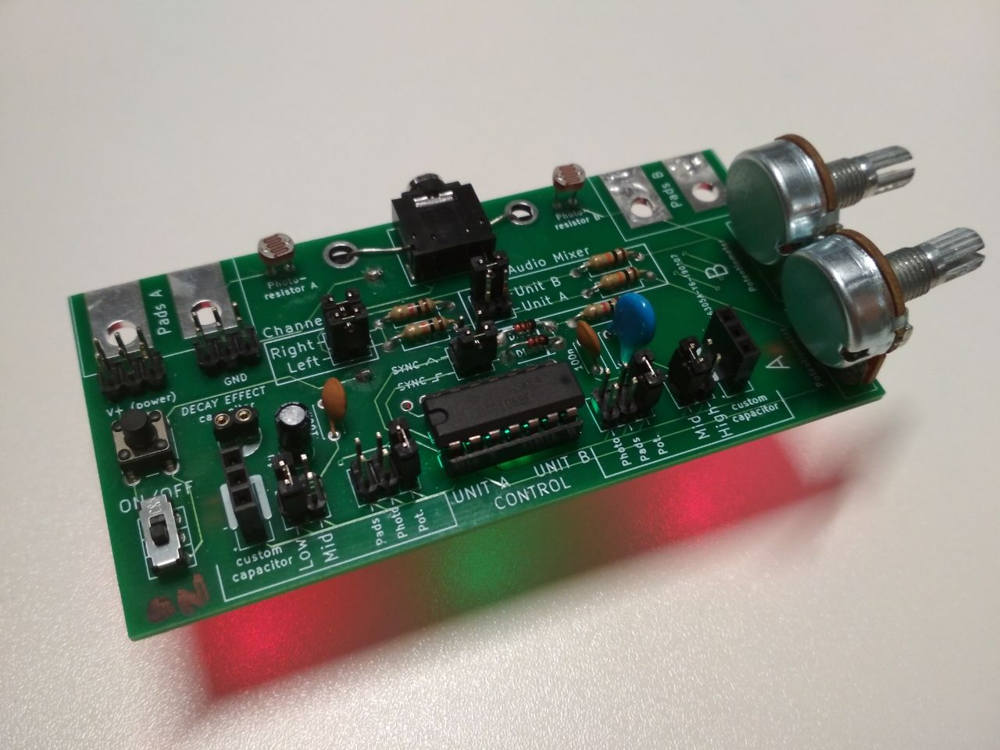
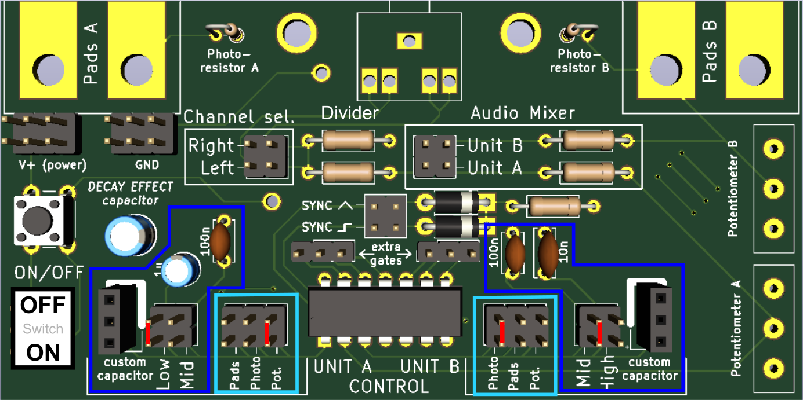
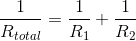
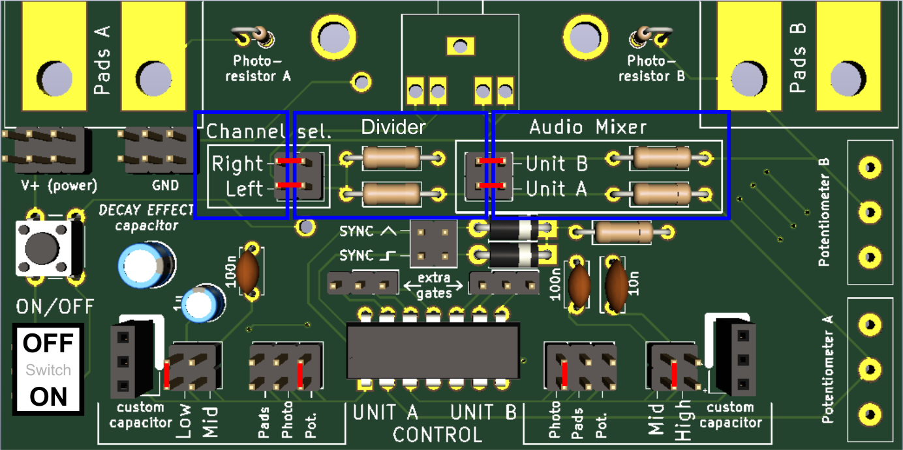
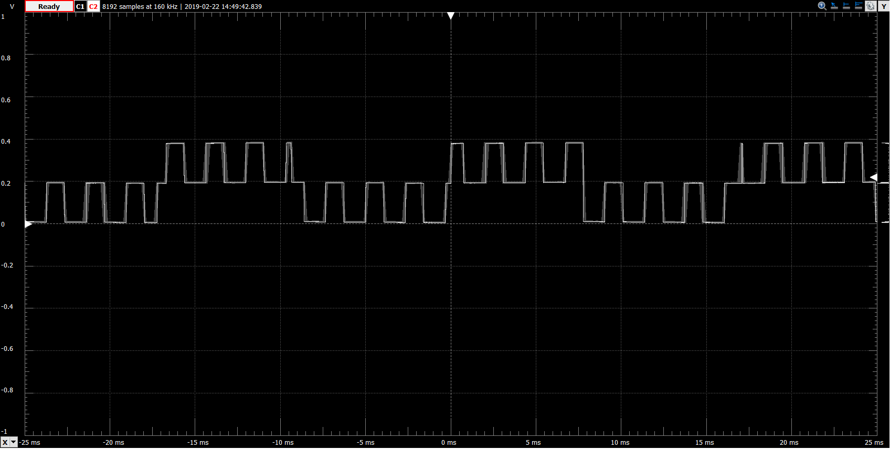
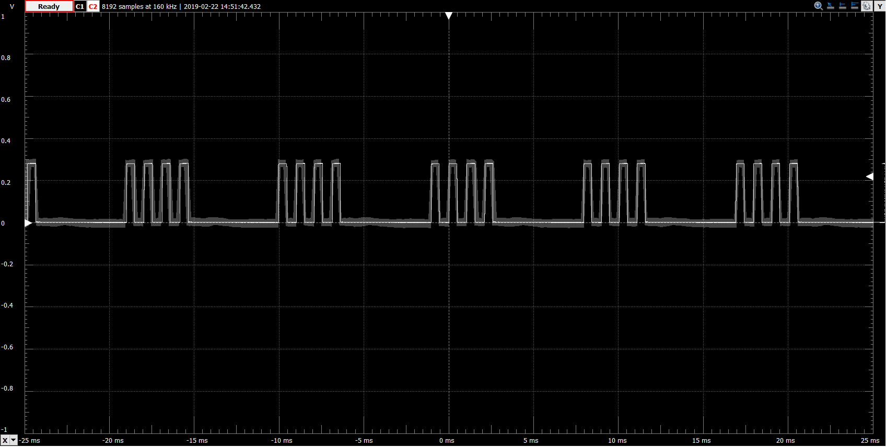
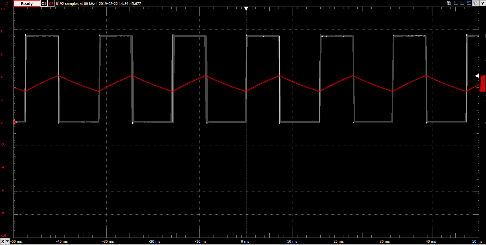

# Digisynth - the pocket Lunetta

A simple Lunetta-type synthesiser based on the 40106 integrated circuit, designed to fit into a pocket, with many configurable options.
Can be controlled by dials, light level and any resistive material. Contains a passive mixer and can utilise oscillator sync.

## Introduction
Lunettas emerged in the 60's/70's as a niche type of synth. They are named after the percussionist [Stanley Lunetta](http://moosack.net/), an experimenter at the boundaries of electronic music, and the father of the original Lunetta. There is a whole [amateur e-book](https://docs.google.com/document/d/1V9qerry_PsXTZqt_UDx7C-wcuMe_6_gyy6M_MyAgQoA/edit) dedicated to Lunettas, with various images and links.

Our pocket synth is based on the 40106 digital logic CMOS inverter, and has been inspired by Elliot Williams' great [digital synthesizer series on Hackaday](https://hackaday.com/2015/02/04/logic-noise-sweet-sweet-oscillator-sounds/). It has a nice detailed explanation of how the synth operates, as well as many expansion circuits, including multi octave synths, sequencers, drums, filters and VCO's. I have some of the components available in surplus and may be able to provide some of them for your builds, or at least point you to good sources of components if you contact me.

## Design information
### Prerequisites
#### View and edit
In order to view and edit the files you are going to need the free open source circuitry tool KiCAD, available from http://kicad-pcb.org/
It is best viewed with version 5.0 and above.

#### Make copies
If all you're after are the build files (Gerber and drill files) which can be sent to a PCB (Printed Circuit Board) manufacturer, they are located within the Gerbers sub-folder. All they need is to be zipped up and uploaded according to the manufacturer's instructions.

### Installing
Download the `Digisynth_PCB` folder and open the `Digisynth.pro` file. It should load cached libraries automatically. If this does not happen, add the `Digisynth-cache.lib` to your library path within KiCAD.
The Gerbers are located within `Digisynth_PCB/Gerbers`.

## Synth manual
The core of the synth consists of a digital logic inverter (NOT Gate) in a feedback loop. The inverter outputs a HIGH voltage on its output pin when there is LOW voltage on its input pin and vice versa. Connecting the input and output pins together will create an oscillating circuit, switching between HIGH and LOW. 
A capacitor connected between the input pin and ground will take some time to charge/discharge after every voltage change, effectively slowing down the switching process. Placing a resistor between the input and output pin limits the current flowing to the capacitor allowing us to further control the charging/discharging time. Longer charging times mean lower frequency, so higher capacitor value (capacity) and higher resistor value (resistance) will both lead to lower frequencies.

The synth consists of various functional blocks, which can be roughly divided into oscillator units, audio blocks and special effect blocks.

### Oscillator units
In order to make the oscillator functional (in the audio range of frequencies), we must choose a capacitor and a resistor. To do this, we can connect jumpers (or some jumper wires), vertically across the pins at the bottom of the board. In the example setup below, the sections are highlighted in blue and connections are represented in red. The setup is using the __Low__ capacitor + __Potentiometer__ for __UNIT A__ and __Mid__ capacitor +  __Photoresistor__ for __UNIT B__.

The options you can select from are:
1. __Capacitors__
- __Low__ - on UNIT A
- __Mid__ - on UNIT A/B
- __High__ - on UNIT B
- __Custom capacitor__ - on UNIT A/B - This is a place where you can add an arbitrary capacitor. The lower pin is connected to `+` and the two upper pins are both connected to `-` (denoted as a white border on the board, here minus = ground), so be sure to place electrolytic capacitors with the right polarity.

When a capacitor is inserted into the *custom capacitor* slot, it always controls the frequency. If you select multiple capacitors, they will be connected in parallel, so their capacity will sum up.

2. __Resistors__
- <b>Potentiometer</b> - allows to control frequency via the appropriate knob (A or B). The resistance should be 0-100kOhm. 
- __Photoresistor__ - frequency control using light. The more light, the higher the tone.
- __Pads__ - the pads are a place to connect your own resistance. Try connecting them together with your fingers (9v is generally safe, unless wires pierce the skin), connecting them through a pencil track (alligator clips are good for this), or connecting them to wires and then running the wires to a stream of water from the tap. You could also build a little keyboard out of different resistors and switches. Feel free to experiment!

When you select multiple resistances, they get connected in parallel and their total resistance will _decrease_, so the frequency will increase. Varying the resistances is then [non-linear according to](https://www.desmos.com/calculator/lihhc9hmr2)  and can be used for interesting effects.

### Audio block
The audio control section consists of three sub blocks.

1. __Mixer__ - a simple passive audio mixer, which allows you to select whether to output sound from UNIT A, UNIT B, or both at the same time. When the two units are close in frequency (or close in an integer multiple of the frequency), you will get a phenomenon know as beats, where a third frequency can he heard arising. A typical view on an oscilloscope of two channels not close is frequency is:

2. __Divider__ - a simple voltage divider, which reduces the voltage from 9 V to about 1V, which is the standard pre-amplified audio level. To bypass this, run jumper wires (DuPont wires) directly from the mixer pins to the *Channel select* pins. This can be also used to connect UNIT A and B to different audio channels, allowing you to control the sound of the left and right speaker independently.
3. __Channel select__ - connects the divided output either to left, right, or both channels on your speakers.

The example above is connected to use UNIT A, UNIT B and both the left and right channel of the speakers.

### Special effects
1. __Decay effect__ - When the decay capacitor is added, an interesting envelope effect upon power off is created, a combination of decreasing volume and increasing frequency. Values of 1uF provide a short sliding end to a tone, values of 100uF produce a nice bouncy effect and 1000uF produce a 30 second slowly increasing slide. If the synthesiser was built with LED's, use larger capacitor values, as the LED's will drain the capacitor fast. Pay attention to the polarity, the negative lead position is marked white.
2. __Oscillator sync__ - when the sync pins are connected, the synth enters a special regime in which UNIT A controls the oscillation of UNIT B. In practice, on an oscilloscope, which plots voltage over time, we can see it as:

In the sync regime, UNIT B controls the pitch (base frequency) of the tone, while UNIT A controls the timbre (color of the tone). Varying the frequency of both can lead to many different effects, sometimes sounding nasal, sometimes resembling beeps, even beating like patterns. Note that UNIT B has to be at a frequency sufficiently higher then UNIT A. If you are not getting any sounds, try adjusting your capacitor/resistor values. You can either use the square or triangle wave (lower or upper pin) for your sync.

3. __Triangle wave__ - the pin labeled _SYNC ^_ (circled red in the image) is connected to the input pin of our IC (directly to the capacitor), unlike the output pin as usual. This gives us a good place to probe the triangle signal. Connecting this pin to the divider pin inside of the Audio Mixer section using a jumper wire (DuPont wire) allows us to send this signal to our speakers. It gives a much cleaner, but also quieter sound, closer to the natural sine waves musical instruments make.
Similarily, the SYNC \_|- pin is a good place to probe the square wave output of UNIT A. Viewed on an oscilloscope, the square wave in white, triangle in red:

### Extra functionality
1. The synth __does not have an ultrasound filter__, allowing you to use it as a source of a fast digital clock (a sequence of HIGH and LOW voltage), which can come in handy in many scenarios, e.g. when testing speeds of oscilloscopes. However, the sound this produces can annoy animals, like dogs, cats, and can be detrimental to the night navigation of bats, so make sure you turn off or disconnect your synth when you've finished buzzing.
2. On the other side of the board, there are pads to solder [surface mount device](https://en.wikipedia.org/wiki/Surface-mount_technology), SMD LED's. As this will interfere to some extent with the decay effect (you'll have to use larger capacitors), it is at your discretion to include it. To limit this, I recommend using a red or yellow LED, and a high value capacitor (~1k).
3. In the top left, pins labeled __V+__ and __GND__ are connected to the battery (V+ only when the synthesizer is on). It is a convenient place to store unjused jumpers, but also a convenient quick power source for any extensions to your synths / other projects.

## License

This project is licensed under the TAPR Open Hardware License (www.tapr.org/OHL).

## Acknowledgments

I would like to thank the [Institute of Making](https://www.instituteofmaking.org.uk/) for making it possible to design this synthesizer and build this synthesizer. I'd also like to thank Elliott Williams for his (already mentioned) [series on Hackaday](https://hackaday.com/2015/02/04/logic-noise-sweet-sweet-oscillator-sounds/), which provided the initial inspiration for this project.